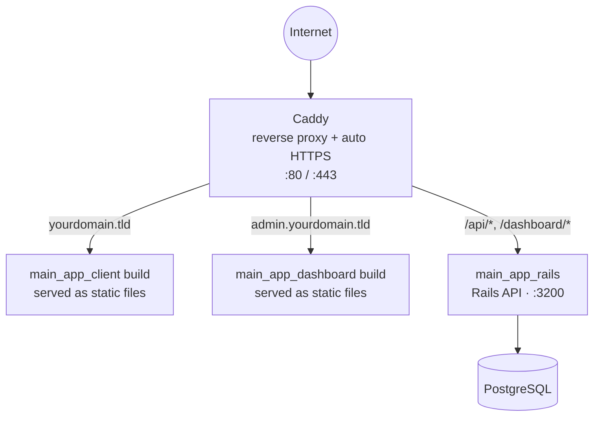

# Deploying to an OVH VPS

Zero-to-live runbook for putting all three services on a single OVH VPS behind Caddy, with free
auto-renewing HTTPS. Replace `yourdomain.tld` / `admin.yourdomain.tld` below with your real
domain and the subdomain you'll use for the dashboard throughout.

## What you end up with

Same shape as the [root README's diagram](README.md#how-it-fits-together), just with Caddy added
in front as the reverse proxy + TLS terminator, and the two frontends served as static builds
instead of Vite dev servers:



Because each frontend is only ever loaded from — and only ever calls — its own domain, there's no
CORS to configure in production either, same as in development.

## Prerequisites

- An OVH account with a domain already bought through OVH (you have this).
- An SSH key on your laptop. If you don't have one yet:
  ```bash
  ssh-keygen -t ed25519 -C "your-email@example.com"
  ```

## 1. Order the VPS

In the OVH control panel: **Bare Metal Cloud → VPS → Order**.

- **Image**: Ubuntu 24.04 LTS.
- **Plan**: at least 4 GB RAM / 2 vCPUs. Skip the cheapest 1–2 GB tier — building the Rails Docker
  image (compiling gems, precompiling bootsnap) is memory-hungry and will thrash on a small box.
  Actual runtime memory use for this stack, once built, is modest.
- **Region**: whichever's closest to Poland in OVH's list — matters for latency, not for anything
  in this guide.
- **SSH key**: if the order flow offers to attach one, paste your public key
  (`cat ~/.ssh/id_ed25519.pub`) now — saves a step below. If not, OVH will email/show you a root
  password instead, and you'll add a key manually right after first login.

Once it's provisioned, note the VPS's **public IPv4 address** — everything below needs it.

## 2. Point DNS at it

OVH control panel: **Web Cloud → Domain names → yourdomain.tld → DNS Zone**.

OVH domains usually come with default `A` records pointing at an OVH parking page — edit those
rather than adding duplicates:

| Type | Subdomain | Target |
|---|---|---|
| A | *(leave blank, i.e. the root)* | your VPS's IPv4 |
| A | `admin` | your VPS's IPv4 |

DNS propagation is usually fast but can take up to a few hours. Check with:

```bash
dig +short yourdomain.tld
dig +short admin.yourdomain.tld
```

Both should print your VPS's IP before you move on to the HTTPS step — Caddy can't get a
certificate for a domain that doesn't resolve to it yet.

## 3. First login and basic hardening

```bash
ssh root@<VPS_IP>
```

Create a non-root user, give it sudo, and copy your key over:

```bash
adduser deploy
usermod -aG sudo deploy
rsync --archive --chown=deploy:deploy ~/.ssh /home/deploy
```

Open a **second** terminal (keep the root session open in case something's wrong) and confirm you
can log in as the new user before touching SSH config:

```bash
ssh deploy@<VPS_IP>
```

Once that works, lock the server down a bit — edit `/etc/ssh/sshd_config` (`sudo nano
/etc/ssh/sshd_config`) and set:

```
PasswordAuthentication no
PermitRootLogin no
```

Then:

```bash
sudo systemctl restart ssh
```

And enable a firewall — only SSH, HTTP, and HTTPS need to be reachable:

```bash
sudo ufw allow OpenSSH
sudo ufw allow 80/tcp
sudo ufw allow 443/tcp
sudo ufw enable
```

A small swapfile is cheap insurance against the Rails image build running out of memory,
regardless of plan size:

```bash
sudo fallocate -l 2G /swapfile
sudo chmod 600 /swapfile
sudo mkswap /swapfile
sudo swapon /swapfile
echo '/swapfile none swap sw 0 0' | sudo tee -a /etc/fstab
```

From here on, everything runs as `deploy`, not `root`.

## 4. Install Docker

```bash
sudo apt-get update
sudo apt-get install -y ca-certificates curl gnupg
sudo install -m 0755 -d /etc/apt/keyrings
curl -fsSL https://download.docker.com/linux/ubuntu/gpg | sudo gpg --dearmor -o /etc/apt/keyrings/docker.gpg
sudo chmod a+r /etc/apt/keyrings/docker.gpg
echo \
  "deb [arch=$(dpkg --print-architecture) signed-by=/etc/apt/keyrings/docker.gpg] https://download.docker.com/linux/ubuntu \
  $(. /etc/os-release && echo "$VERSION_CODENAME") stable" | \
  sudo tee /etc/apt/sources.list.d/docker.list > /dev/null
sudo apt-get update
sudo apt-get install -y docker-ce docker-ce-cli containerd.io docker-buildx-plugin docker-compose-plugin
sudo usermod -aG docker deploy
```

Log out and back in (`exit`, then `ssh deploy@<VPS_IP>` again) for the group membership to apply,
then confirm:

```bash
docker run hello-world
```

## 5. Get the code onto the server

The repo is private, so generate a deploy key scoped to just this box and this repo, rather than
reusing your personal GitHub key:

```bash
ssh-keygen -t ed25519 -C "foodmap-vps" -f ~/.ssh/foodmap_deploy -N ""
cat ~/.ssh/foodmap_deploy.pub
```

Copy that output into **GitHub → your repo → Settings → Deploy keys → Add deploy key** (read-only
is enough). Then point SSH at it and clone:

```bash
cat >> ~/.ssh/config <<'EOF'
Host github.com
  IdentityFile ~/.ssh/foodmap_deploy
  IdentitiesOnly yes
EOF

git clone git@github.com:JakubDashDev/foodmap-demo.git
cd foodmap-demo
```

## 6. Configure secrets

```bash
cp .env.production.example .env.production
```

Edit `.env.production` (`nano .env.production`) and fill in:

- `DOMAIN` / `ADMIN_DOMAIN` — your two real domains.
- `DB_PASSWORD` — anything random, e.g. `openssl rand -hex 24`.
- `JWT_SECRET_KEY` and `SECRET_KEY_BASE` — each from `openssl rand -hex 64`. Use two **different**
  values — they secure different things (access tokens vs. cookie encryption).

This file never gets committed — it's covered by the root `.gitignore`.

## 7. First deploy

```bash
./deploy.sh
```

This builds both frontends with a throwaway Node container, then builds and starts Postgres,
Rails, and Caddy. First run takes a few minutes (installing gems/packages, building images). It
ends by tailing logs — watch for Caddy successfully obtaining certificates for both domains
(look for `certificate obtained successfully` in its log lines). `Ctrl-C` stops watching without
stopping the stack.

If a cert fails to issue, it's almost always DNS — re-check step 2 before anything else.

## 8. Create the first admin user and load demo data

```bash
docker compose -f docker-compose.prod.yml exec rails bin/rails db:seed
docker compose -f docker-compose.prod.yml exec rails bin/rails runner \
  'AdminUser.create!(email: "you@example.com", password: "change-me-please")'
```

Then visit `https://admin.yourdomain.tld` and log in, and `https://yourdomain.tld` to see the
public map.

## Redeploying after changes

```bash
cd foodmap-demo
git pull
./deploy.sh
```

## Backing up the database

The `postgres_data` Docker volume is the only thing that isn't reproducible from git. A simple
daily dump via cron:

```bash
# crontab -e
0 3 * * * docker compose -f /home/deploy/foodmap-demo/docker-compose.prod.yml exec -T db \
  pg_dump -U foodmap postgres > /home/deploy/backups/foodmap-$(date +\%F).sql
```

(Create `/home/deploy/backups` first, and consider copying dumps off the box periodically —
a backup that lives only on the server it's backing up doesn't survive the server dying.)

## Troubleshooting

| Symptom | Likely cause |
|---|---|
| Caddy never gets a certificate | DNS for that domain isn't pointing at the VPS yet, or ports 80/443 aren't reachable (check `ufw status` and that OVH's own network firewall, if enabled on the VPS, allows them). |
| 502 from Caddy | Rails isn't up yet or crashed on boot — `docker compose -f docker-compose.prod.yml logs rails`. |
| Login works but the session doesn't stick | Confirm you're on `https://`, not `http://` — the auth cookies are `secure`-only in production, so they're silently dropped over plain HTTP. |
| `deploy.sh` fails during the frontend build | Usually an out-of-memory kill on a small VPS — confirm the swapfile from step 3 is active (`swapon --show`). |
