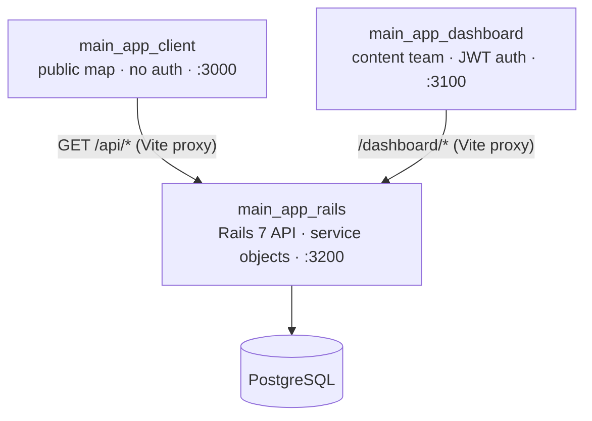

# Foodmap

Foodmap aggregates restaurant and food-spot reviews published by YouTube and TikTok food
creators, and plots them on a map so people can find places actually worth visiting nearby —
instead of scrolling back through a creator's channel history.

The repo is one Postgres-backed Rails API behind two independent React frontends: a public map
client, and an internal dashboard the content team uses to keep locations, reviews, and creators
up to date.

## Contents

- [How it fits together](#how-it-fits-together)
- [Engineering highlights](#engineering-highlights)
- [Tech stack](#tech-stack)
- [Repo layout](#repo-layout)
- [Running it locally](#running-it-locally)
- [Testing & CI](#testing--ci)

## How it fits together



Both frontends are separate Vite apps with their own dependencies and deploy targets — they don't
share a build, only a set of conventions. In development, each one proxies its API calls straight
to the Rails container, so there's no CORS to configure and no separate API gateway to run.

## Engineering highlights

A few decisions worth pointing out if you're skimming this before a technical screen:

- **Refresh-token rotation with reuse detection.** The dashboard's session isn't just "a JWT that
  expires" — every refresh issues a new token in the same family and marks the old one used. If an
  already-used or expired token is presented again (the signal a token was stolen and replayed),
  the entire family is invalidated under a row lock. See
  [`app/services/auth/rotate_refresh_token.rb`](main_app_rails/app/services/auth/rotate_refresh_token.rb).
- **CSRF-safe cookies on an API-only app.** Auth cookies are `httponly`, `secure` in production,
  and `same_site: :strict` — a real mitigation, not a framework default, since Rails API mode
  doesn't set any of this up for you.
- **Deduplicated token refresh on the frontend.** A burst of concurrent 401s triggers exactly one
  `/refresh` call — every caller awaits the same in-flight promise — and only the original request
  is retried. See
  [`main_app_dashboard/src/features/api/session.ts`](main_app_dashboard/src/features/api/session.ts).
- **Allow-listed sort columns.** Every search/sort service (`Locations::Query`, `Reviews::Query`,
  `ContentCreators::Query`) validates `sort_by` against an explicit column list before it reaches
  SQL, instead of passing the query param straight into `.order()`.
- **Validated video embeds.** User-sourced YouTube URLs are parsed with `new URL()` and checked
  against an explicit hostname allow-list before anything renders in an `<iframe>`, pointed at
  `youtube-nocookie.com` with a scoped `allow` attribute. See
  [`main_app_client/src/components/app/locationModal/youtube.ts`](main_app_client/src/components/app/locationModal/youtube.ts).
- **Per-service CI.** The GitHub Actions pipeline path-filters on each push, so a frontend-only
  change doesn't spin up Postgres and run RSpec, and vice versa. See
  [`.github/workflows/pr-validation.yml`](.github/workflows/pr-validation.yml).

## Tech stack

| | |
|---|---|
| **API** | Ruby 3.2 · Rails 7.1 (API-only) · PostgreSQL · JWT + rotating refresh tokens · Oj serializers · RSpec |
| **Dashboard** | React 19 · TypeScript · Redux Toolkit / RTK Query · react-hook-form + Zod · Tailwind CSS v4 · Base UI |
| **Client** | React 19 · TypeScript · MapLibre GL + Supercluster · Redux Toolkit / RTK Query · Tailwind CSS v4 |
| **Tooling** | Docker Compose · pnpm · ESLint + Prettier · GitHub Actions |

## Repo layout

| Path | What it is |
|---|---|
| [`main_app_rails/`](main_app_rails) | The API. Dashboard CRUD + public read endpoints. [README](main_app_rails/README.md) |
| [`main_app_dashboard/`](main_app_dashboard) | Internal tool for managing locations, reviews, and content creators. [README](main_app_dashboard/README.md) |
| [`main_app_client/`](main_app_client) | The public map. [README](main_app_client/README.md) |
| [`docker-compose-dev.yml`](docker-compose-dev.yml) | Runs all three services plus Postgres together for local development. |
| [`docker-compose.prod.yml`](docker-compose.prod.yml) / [`Caddyfile`](Caddyfile) / [`deploy.sh`](deploy.sh) | Production stack — see [`DEPLOYMENT.md`](DEPLOYMENT.md). |
| [`.github/workflows/pr-validation.yml`](.github/workflows/pr-validation.yml) | CI: lint + format on both frontends, RSpec on the API, path-filtered per PR. |

## Running it locally

The whole stack runs with Docker Compose — no local Ruby, Node, or Postgres installation needed.

```bash
# 1. Rails needs one secret to boot — generate it and drop it in main_app_rails/.env
cp main_app_rails/.env.example main_app_rails/.env
# fill JWT_SECRET_KEY with:
#   openssl rand -hex 64

# 2. Build and start everything
docker compose -f docker-compose-dev.yml up --build
```

| Service | URL |
|---|---|
| Client (public map) | http://localhost:3000 |
| Dashboard (admin) | http://localhost:3100 |
| Rails API | http://localhost:3200 |

The dashboard has no self-serve sign-up and the database starts empty — see the
[API README](main_app_rails/README.md#demo-data) for loading demo locations/reviews and creating
an `AdminUser` to log in with. Each app's own README also covers running it outside Docker.

## Testing & CI

```bash
# API
cd main_app_rails && bundle exec rspec

# Either frontend
cd main_app_dashboard && pnpm lint && pnpm format
cd main_app_client && pnpm lint && pnpm format
```

`spec/services/auth/` and `spec/requests/dashboard/authentications_spec.rb` cover the refresh-token
rotation end to end, including token reuse and expiry. Every pull request runs the checks above
scoped to whichever service(s) actually changed.


Built by **Jakub Cieślik**.
<!-- Add links before publishing, e.g.: [LinkedIn](...) · [Portfolio](...) · [Email](mailto:...) -->
